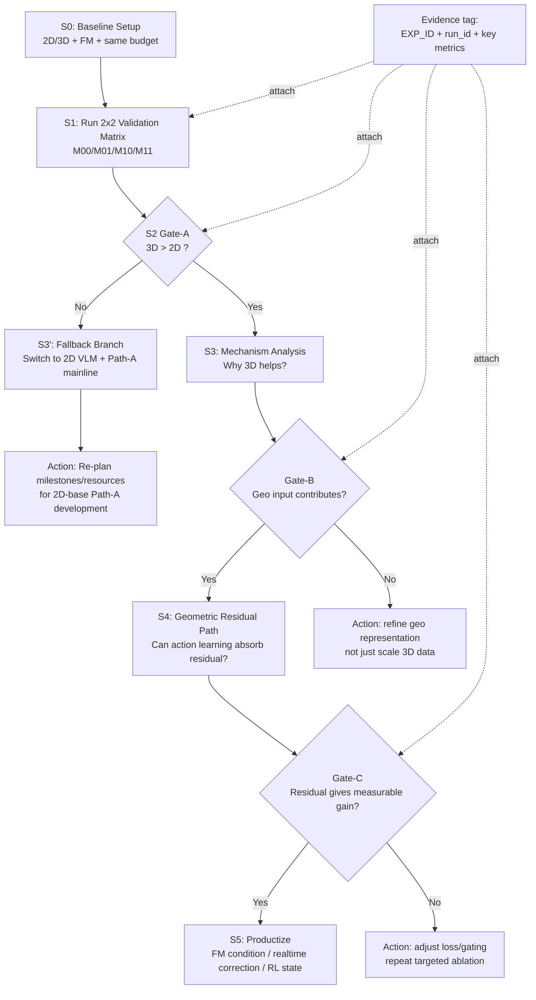

# 项目图 v2 规范（决策树 + 验证矩阵）

- EXP_ID: `ALG1-INFRA-20260305-001-OC`
- 目的：把当前手绘项目图升级为可执行、可追溯、可协作的标准图
- 适用：周会汇报、导师评审、实验推进与任务拆解

---

## 1. 图中信息分层（必须区分）

建议把所有节点分为 5 类，并固定视觉样式：

1. **事实 Fact（绿色）**：已被实验验证的结论。
2. **假设 Hypothesis（虚线灰）**：待验证推断或机制猜测。
3. **决策 Decision（黄色菱形）**：通过/回退分叉。
4. **动作 Action（蓝色）**：下一步实验或工程任务。
5. **证据 Evidence（紫色标签）**：`EXP_ID`、`run_id`、关键指标。

---

## 2. v2 阶段编号（建议直接贴图标注）

- `S0` 基线定义：2D/3D、几何有无、Flow Matching 一致化。
- `S1` 验证矩阵运行：四象限最小矩阵（20k steps 起步）。
- `S2` 基础分叉：`3D > 2D` 或 `3D <= 2D`。
- `S3` 机制探索：空间几何先验注入与“几何残差”可学习性。
- `S4` 机制落地：把几何残差用于 FM 条件、实时纠偏、强化学习状态。
- `S5` 产出与收敛：固定主线 + 回退策略 + 里程碑交付。

---

## 3. 最小验证矩阵（替代“口头对比”）

| 实验ID | VLM | 几何输入 | 训练步数 | 目标 |
|---|---|---|---:|---|
| M00 | 2D | 无 | 20k | 基线下界 |
| M01 | 2D | 有 | 20k | 检验几何注入本身价值 |
| M10 | 3D | 无 | 20k | 检验3D预训练先验价值 |
| M11 | 3D | 有 | 20k | 联合优势上界 |

> 注意：四象限只用于“方向判别”，不是最终收敛实验。

---

## 4. 分叉门槛（建议写进图中 Decision 旁）

### Gate-A: `3D > 2D` 判定

- 主指标：`Success@LIBERO`
- 建议门槛：`3D - 2D >= +3pp`（同任务集、同预算）
- 同时满足：
  - `p95 latency` 不劣化超过 `20ms`
  - 稳定性无异常（nonfinite/崩溃为0）

Gate-A 失败后的硬策略（新增）：

- 若 3D 在 `geo off` 和 `geo on` 两条线均落后于 2D（即 `M10<M00` 且 `M11<M01`），
- 则不继续加码 3D 主线，改为 `2D VLM + Path-A` 作为当前主研发路线。

### Gate-B: 几何注入有效判定（有 geo vs 无 geo）

- 建议门槛：`with_geo - without_geo >= +2pp`
- 辅助证据：mask/残差相关指标方向一致改善

### Gate-C: 机制落地判定（几何残差可用）

- 至少一个落地方向满足收益且可复现：
  1. 作为 FM 去噪条件
  2. 作为实时纠偏信号
  3. 作为 RL 状态补充

---

## 5. 建议替换为下图（Mermaid）

---

## 6. 你的原图可直接优化的 7 点

1. 给每个节点加 `S0~S5` 编号（减少口头解释成本）。
2. 区分“已证据结论”与“待验证假设”（颜色+虚线）。
3. 把“进行中”改为具体节点状态（例如 `S3 IN_PROGRESS`）。
4. 每个决策分叉旁写定量门槛（不是“感觉更好”）。
5. 每个关键节点下加 `EXP_ID` 标签占位。
6. 把“pass”改成具体决策动作（暂停/回退/继续）。
7. 在图底部固定“输入证据最小集”：`config + metrics + log + run_identity`。

---

## 7. 与当前报告的对齐关系

该 v2 图建议对应到详报章节：

- `B/C`：项目目标与主问题
- `H`：验证矩阵与分叉门槛
- `I`：里程碑与每阶段 Exit Criteria
- `J/K`：状态、风险、回退策略
- `M`：ADR（为何选该主线）
